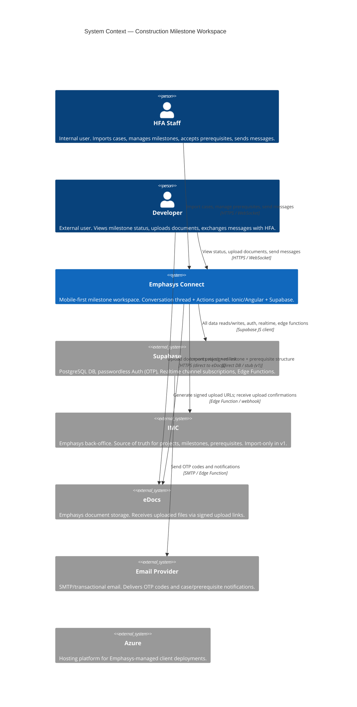

# Construction Milestone Workspace — System Context

## System Overview

Emphasys Connect is a mobile-first coordination workspace where HFA staff and Developers track construction funding milestones and prerequisites together. Cases are imported from IMC (the Emphasys back-office system) — the app never owns case structure. Documents are submitted via eDocs upload links — the app never stores files. A single conversation thread per case mixes live system events with manual HFA↔Developer messages, kept in sync via Supabase Realtime.

## Context Diagram

## Actors

| Actor | Type | Description |
|---|---|---|
| **HFA Staff** | Human (internal) | Authenticated via passwordless OTP; `is_hfa: true` in Supabase. Imports cases, activates milestones, accepts/returns prerequisites, adds manual messages, @-mentions Developer. |
| **Developer** | Human (external) | Authenticated via passwordless OTP. Invited when HFA imports case. Views milestone/prerequisite status (read-only), uploads documents via eDocs link, sends manual messages, @-mentions HFA. |
| **Supabase** | Platform | Provides the database (PostgreSQL + RLS), passwordless auth (OTP), realtime channel broadcasting, and edge function runtime. The app has no custom API server — Angular services call Supabase directly. |
| **IMC** | External system | Emphasys back-office. Source of truth for project/milestone/prerequisite structure. The app imports a snapshot on case creation. In v1, this may be stubbed with seeded data. |
| **eDocs** | External system | Emphasys document storage. Receives uploaded files via signed URLs generated by Edge Functions. Upload completion flips prerequisite to `received_processing`. |
| **Email Provider** | External system | Delivers Supabase OTP codes and case/prerequisite/mention notifications via Edge Functions. |

## External Integrations

| System | Direction | Data Exchanged | Protocol | Hackathon |
|---|---|---|---|---|
| **Supabase** | Both | All app data (cases, milestones, prerequisites, messages), auth sessions, realtime events | Supabase JS client (WebSocket + REST) | Live |
| **IMC** | Inbound | Project name, address, developer contact, milestone list, prerequisite list per milestone | Direct DB access / stub | Stubbed with seed data |
| **eDocs** | Outbound (URL gen) + Inbound (upload confirmation) | Signed upload URL → Developer uploads file → eDocs confirms completion → prerequisite status flip | Edge Function + webhook (or polling) | Stubbed with mock confirm button |
| **Email Provider** | Outbound | OTP codes, case-created notifications, prerequisite activation emails with upload link, @-mention notifications | SMTP via Supabase Edge Function | Local SMTP (Supabase local) |
| **Azure** | Hosting | Deployed Supabase instance + Angular app static assets | Cloud hosting | N/A (local dev for hackathon) |

## Data Flows

### Inbound
| Source | Data | Trigger |
|---|---|---|
| IMC | Project snapshot: title, address, developer contact, milestones, prerequisites | HFA presses "Import from IMC" |
| eDocs | Upload confirmation: `prerequisite_id`, `document_id` | Developer uploads file via signed link |
| HFA Staff | Manual message, @-mention, accept/return action | User interaction in Actions or Conversation panel |
| Developer | Manual message, @-mention | User interaction in Conversation panel |
| Supabase Auth | Authenticated session (JWT) | User enters valid OTP |

### Outbound
| Destination | Data | Trigger |
|---|---|---|
| Developer (email) | Case-created notification + link | Case imported from IMC |
| Developer (email) | Prerequisite activation + upload link | HFA activates milestone |
| Developer (email) | Prerequisite accepted/returned notification | HFA accepts or returns |
| HFA Staff (email) | Document received notification | Developer uploads via eDocs |
| Any participant (email) | @-mention notification | User sends message containing @-mention |
| All connected clients | Realtime broadcast: new message, prerequisite status change, milestone status change | Any DB write to `conversation_messages`, `prerequisites`, `milestones` |

## High-Level Constraints

- App never stores documents — all files route through eDocs
- App never owns case structure — IMC is authoritative; the app holds an imported snapshot
- `hfa_id` on every entity; Supabase RLS enforced from day one (not mocked)
- No custom API server — Angular calls Supabase JS client directly; server-side logic in Edge Functions
- Supabase anon key safe for client; service role key only in Edge Functions (never in Angular bundle)
- Ionic used for mobile chrome only — no `IonModal`, `IonActionSheet`, `IonAlert`
- Mobile-first responsive; two-panel HFA layout must reflow to single column on mobile

## Key NFR Goals

- **Realtime latency**: Supabase broadcast reaches all connected clients < 1 second (hero demo requirement)
- **Auth UX**: OTP entry flow completes in < 30 seconds end-to-end
- **Case detail load**: Time to interactive < 1 second on local dev
- **Security**: RLS policies prevent cross-tenant and cross-case data leaks from day one
- **Reliability**: Supabase client auto-reconnects on drop; no manual refresh required during demo
